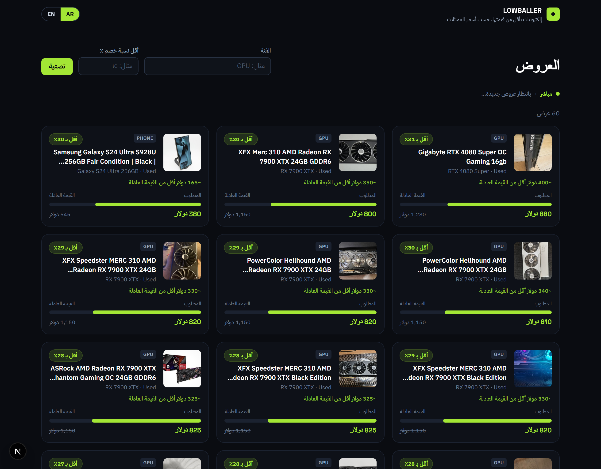
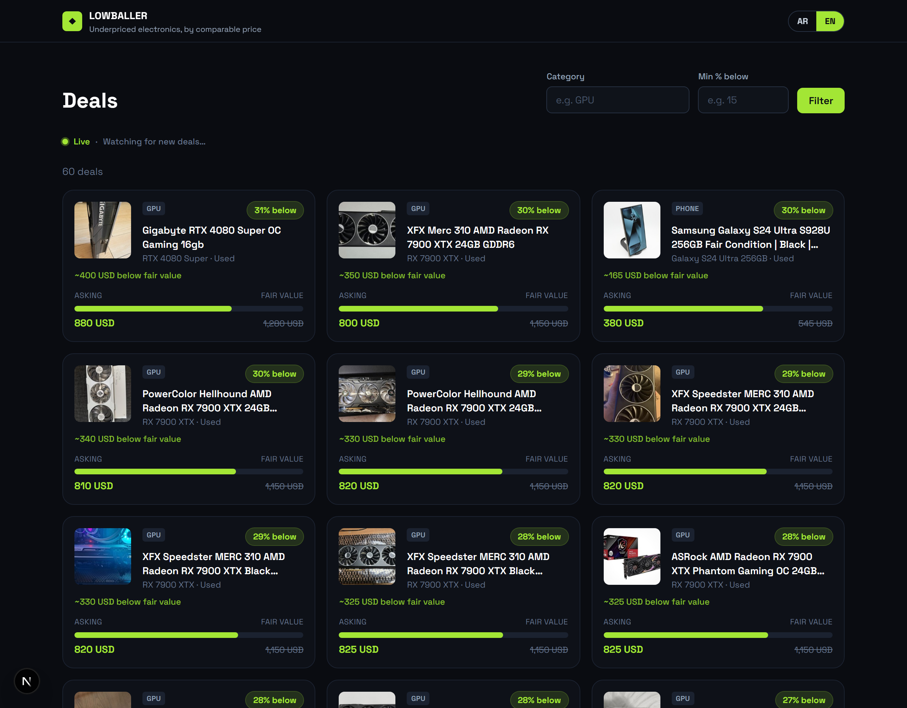
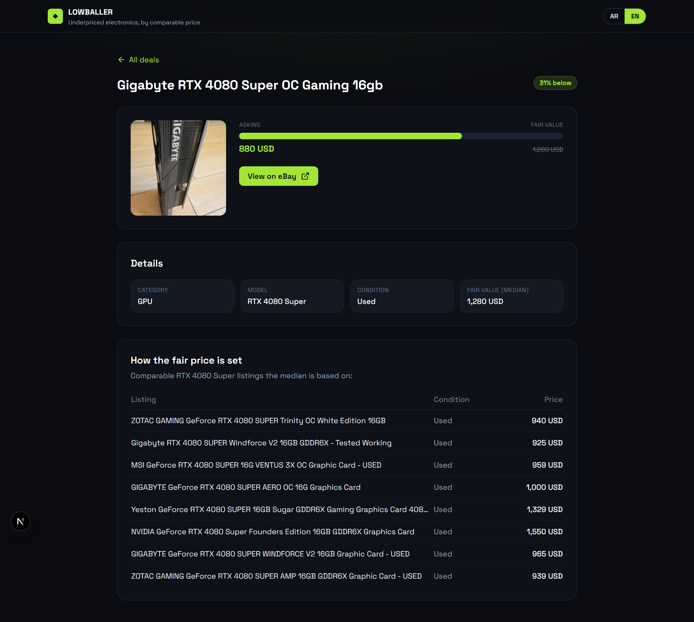

# Lowballer 💸

**A marketplace mispricing detector.** Lowballer pulls real listings, estimates each
item's fair value from comparable listings, and surfaces the ones priced materially
**below** it — in a real-time, bilingual dashboard.

It currently runs on **eBay electronics** (GPUs, phones, consoles, laptops) via the
official eBay API. Fair value = the **median of comparable same-model listings**; anything
well below it — after stripping out defective / locked / wrong-variant noise — is a deal.

> A Gigabyte RTX 4080 Super at **$880** when comparable cards sell for a **$1,280** median
> (~31% below) gets flagged and streams onto the dashboard live.

<!-- Add after deploying: [**Live demo →**](https://your-app.vercel.app) -->

## What it does

1. **Pulls** real priced listings via the **eBay Browse API** (a watchlist of exact models).
2. **Values** each against its comps — median of same-model listings, outlier-trimmed.
3. **Filters the noise** — category + relevance + condition rules drop accessories, broken,
   carrier-locked, and wrong-variant listings (cheap-for-a-reason ≠ a deal). *This is the
   hard part on an efficient market.*
4. **Flags & serves** the underpriced ones in a **real-time** (SSE) dark dashboard, fully
   **bilingual (AR / EN, RTL)**, with the comparable listings behind each price.

> **Why not Haraj (the original target)?** This began as a used-car deal-finder for the
> Saudi market. I built an ML valuation model *and* a working Haraj scraper — then measured
> that **~99% of Haraj listings don't publish a price**, so I pivoted to a marketplace that
> does. That whole journey is documented in **[The pivot](#the-pivot-haraj--ebay)** — it's
> the most interesting part.

## The pivot: Haraj → eBay

The interesting part of this project is *why the data source changed.*

**Attempt 1 — Haraj (Saudi used cars).** I built the whole thing: a gradient-boosted
valuation model trained on real Saudi sale prices (below), and a live Haraj scraper that
**reverse-engineers their React-Router "turbo-stream"** to recover structured price/specs
(Haraj client-side-renders, so the data isn't in the HTML). Then I measured the catch:
**~99% of Haraj car listings don't publish a price** — sellers negotiate in chat. A live
900-listing scan turned up **2 priced cars**. You can't flag underpricing without a price.

**Attempt 2 — eBay (electronics).** eBay publishes a price on every listing *and* exposes
exact-model search → clean comparables. Scraping is blocked by their anti-bot, so Lowballer
uses the **official eBay Browse API**. Valuation switches from the ML model to a
**comps-median**. The new hard problem is **noise** — the cheapest listings are usually
defective/locked/wrong-variant, so most of the work is relevance + condition filtering to
tell real deals from cheap-for-a-reason.

The Haraj-era ML model + scraper still live in the repo — they're real engineering, and the
findings below are part of the story.

## The Haraj-era valuation model

XGBoost on log-price, trained on the [Saudi Arabia Used Cars dataset](https://www.kaggle.com/datasets/turkibintalib/saudi-arabia-used-cars-dataset)
(5,389 cleaned listings):

| Metric | Value |
|---|---|
| MAE | ~11,800 SAR |
| R² | 0.89 |
| MAPE | 16.6% (median 10.6%) |

Honest, domain-typical accuracy for used-car valuation. Feature importances rank make
premium (Mercedes, Lexus, Land Rover), `engine_size`, `year`, and `age` highest — as
expected for this market. A synthetic dataset of identical schema ships as a fallback so
the repo runs with no download.


## The mispricing detector (backtest)

A good model isn't enough — the **flag rule** has to catch real deals without false alarms.
Backtested on held-out cars (asking prices simulated around true market value):

| Threshold | Precision | Recall | F1 |
|---|---|---|---|
| 10% | 0.73 | 0.83 | 0.78 |
| **12%** (default) | **0.75** | **0.82** | **0.78** |
| 15% | 0.77 | 0.77 | 0.77 |
| 20% | 0.83 | 0.68 | 0.74 |

12% is the best-F1 operating point on real data — recall-favoring (surface more, let the
user filter), while a 45% discount trips a **"needs review"** scam/salvage guard.


## The Arabic normalizer (the core of the scraper)

Haraj listings are unstructured Arabic prose. `app/scraper/normalize.py` turns:

```
تويوتا كامري موديل ٢٠١٩ ماشي ٩٠ الف نظيفه وارد اوتوماتيك السعر ٦٨٠٠٠
```

into:

```json
{ "make": "Toyota", "model": "Camry", "year": 2019, "mileage_km": 90000,
  "gear_type": "Automatic", "origin": "Imported", "price": 68000 }
```

handling Arabic-Indic digits (٩٠→90), the "الف" thousands unit, bilingual make/model
dictionaries, and gear/fuel/origin/region keywords.

## Screenshots

Dark "fintech" UI, fully **bilingual (Arabic / English)** with first-class **RTL** support
(locale-routed `/ar` · `/en`). Real eBay deals with product images, condition, and the
comparable listings behind each median.

| العربية (RTL) | English (LTR) |
|---|---|
|  |  |



## Realtime

Newly flagged deals stream to the dashboard live over **Server-Sent Events** (FastAPI
`/deals/stream` → an `EventSource` on the client) — no refresh, no extra infrastructure.
They land in a highlighted **New deals** row with a `NEW` badge while a live indicator pulses.

## Architecture

In short: **eBay Browse API → comps-median valuation + noise filtering → flag →
Postgres/SQLite → FastAPI → Next.js**, with new deals pushed over SSE. The Haraj-era
pipeline (scrape → turbo-stream parse → normalize → ML value) is documented in
[docs/architecture.md](docs/architecture.md).

## Tech stack

Next.js · TypeScript · Tailwind · next-intl (AR/EN + RTL) (Vercel) — FastAPI · SSE ·
**eBay Browse API** · comps-median valuation (Railway) — SQLAlchemy over SQLite/Supabase
Postgres. *Haraj era:* XGBoost · scikit-learn · a turbo-stream scraper.

## Getting started

```bash
# backend
cd backend && python -m venv .venv && .venv/Scripts/python -m pip install -r requirements.txt

# eBay deals (the current product) — put free keys in backend/.env first:
#   EBAY_CLIENT_ID / EBAY_CLIENT_SECRET   (from developer.ebay.com)
.venv/Scripts/python -m app.ebay.check "RTX 4090"      # smoke-test the API
.venv/Scripts/python -m app.ebay.ingest                # real deals into the DB
.venv/Scripts/python -m uvicorn app.main:app --reload  # :8000

# frontend
cd ../frontend && npm install && npm run dev            # http://localhost:3000

# Haraj-era ML pipeline (optional, no accounts needed):
#   .venv/Scripts/python -m ml.train && python -m ml.evaluate && python -m ml.backtest
```

Tests: `cd backend && .venv/Scripts/python -m pytest -q` (18 passing).

## Status

- **Current — eBay electronics deal-finder:** ✅ live (real Browse API data, comps-median
  valuation + noise filtering, product UI, realtime SSE, AR/EN RTL).
- **Haraj era (in repo):** ✅ ML valuation model (real Saudi data, backtested) · ✅
  turbo-stream scraper · the price-availability finding that drove the pivot.
- **Deferred:** Telegram alerts, auth / saved searches, cloud deploy (wired, pending accounts).
