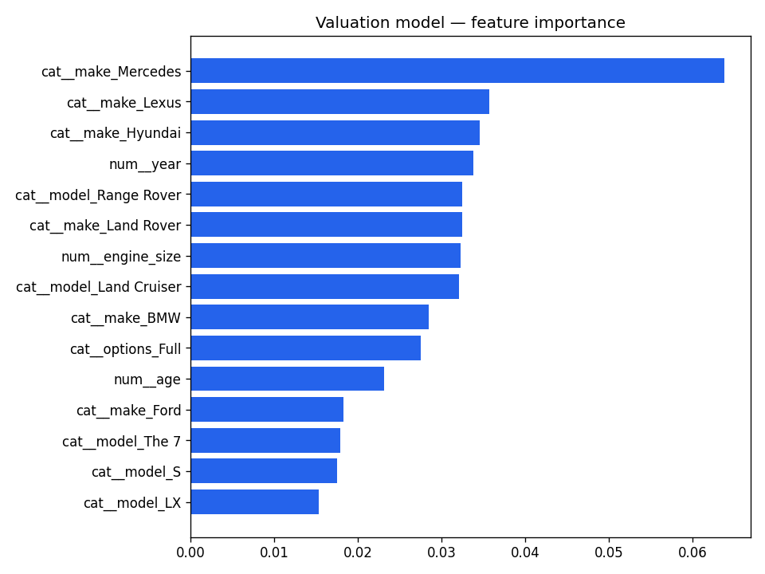
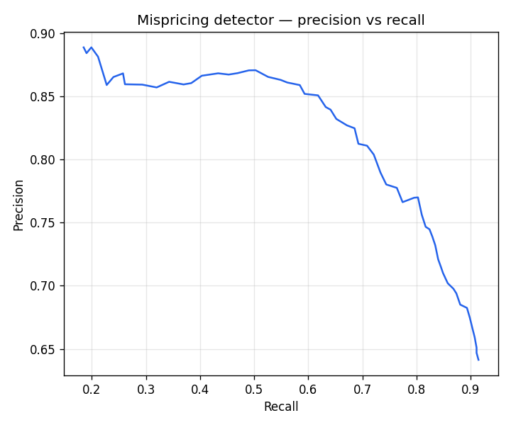
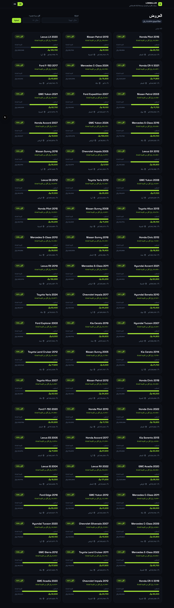
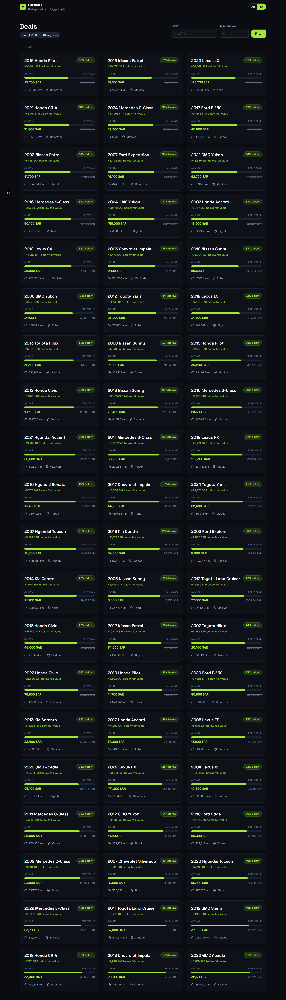
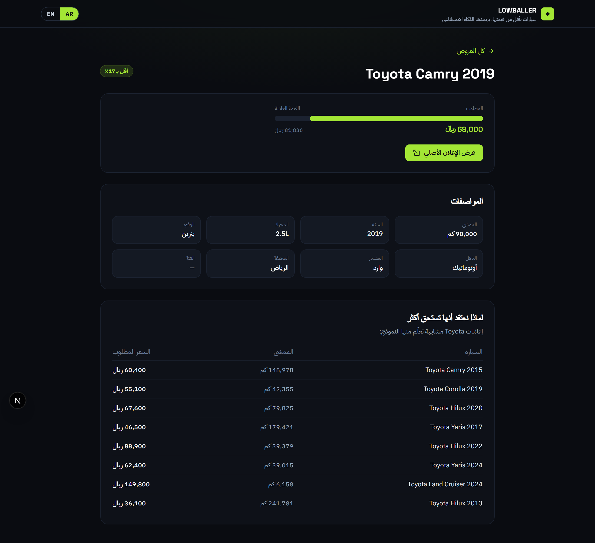
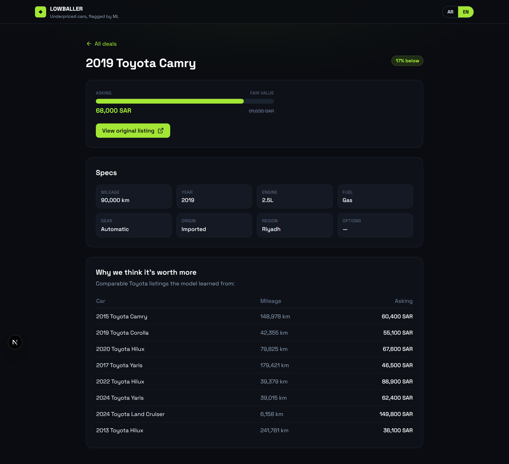
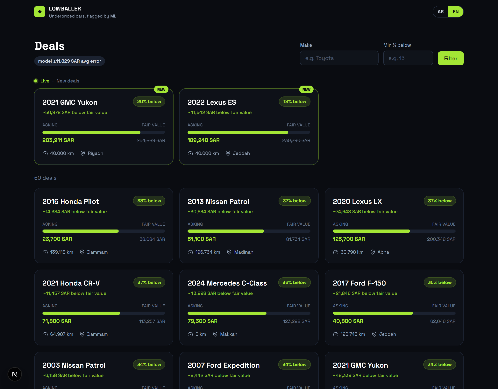

# Lowballer 🚗💸

**A used-car mispricing-detection system.** Lowballer scrapes the Saudi classifieds
market (Haraj), estimates each car's fair market value with a machine-learning model, and
surfaces listings priced materially **below** what they're worth — in real time, with the
comparable cars that justify each call.

> A 2019 Camry listed for 68,000 SAR when the model values it at ~82,000 — a ~17%
> underpricing — gets flagged and pushed to the dashboard the moment it's parsed.

<!-- Add after deploying: [**Live demo →**](https://your-app.vercel.app) -->

## Why it's more than a scraper

The hard part isn't fetching listings — it's **valuation**. Knowing a car is underpriced
requires a reliable fair-value estimate from messy, unstructured Arabic text. Lowballer
is built around that:

1. **Trains** a gradient-boosted model on real Saudi sale prices, with measured accuracy.
2. **Scrapes** live Haraj listings and **normalizes Arabic free-text** into the model's
   feature schema.
3. **Flags** listings well below predicted value — backtested for precision/recall.
4. **Serves** them in a **real-time** dashboard — new deals stream in live via SSE — with
   the comps behind each valuation.

## The valuation model

XGBoost on log-price, trained on the [Saudi Arabia Used Cars dataset](https://www.kaggle.com/datasets/turkibintalib/saudi-arabia-used-cars-dataset)
(5,389 cleaned listings):

| Metric | Value |
|---|---|
| MAE | ~11,800 SAR |
| R² | 0.89 |
| MAPE | 16.6% (median 10.6%) |

Honest, domain-typical accuracy for used-car valuation. Feature importances rank make
premium (Mercedes, Lexus, Land Rover), `engine_size`, `year`, and `age` highest — as
expected for this market. A synthetic dataset of identical schema ships as a fallback so
the repo runs with no download.



## The mispricing detector (backtest)

A good model isn't enough — the **flag rule** has to catch real deals without false alarms.
Backtested on held-out cars (asking prices simulated around true market value):

| Threshold | Precision | Recall | F1 |
|---|---|---|---|
| 10% | 0.73 | 0.83 | 0.78 |
| **12%** (default) | **0.75** | **0.82** | **0.78** |
| 15% | 0.77 | 0.77 | 0.77 |
| 20% | 0.83 | 0.68 | 0.74 |

12% is the best-F1 operating point on real data — recall-favoring (surface more, let the
user filter), while a 45% discount trips a **"needs review"** scam/salvage guard.



## The Arabic normalizer (the core of the scraper)

Haraj listings are unstructured Arabic prose. `app/scraper/normalize.py` turns:

```
تويوتا كامري موديل ٢٠١٩ ماشي ٩٠ الف نظيفه وارد اوتوماتيك السعر ٦٨٠٠٠
```

into:

```json
{ "make": "Toyota", "model": "Camry", "year": 2019, "mileage_km": 90000,
  "gear_type": "Automatic", "origin": "Imported", "price": 68000 }
```

handling Arabic-Indic digits (٩٠→90), the "الف" thousands unit, bilingual make/model
dictionaries, and gear/fuel/origin/region keywords.

## Screenshots

Dark "fintech" UI, fully **bilingual (Arabic / English)** with first-class **RTL** support
(locale-routed `/ar` · `/en`, Arabic-first). UI strings *and* spec values are translated
(e.g. Automatic → أوتوماتيك, Riyadh → الرياض).

| العربية (RTL) | English (LTR) |
|---|---|
|  |  |
|  |  |

## Realtime

Newly flagged deals stream to the dashboard live over **Server-Sent Events** (FastAPI
`/deals/stream` → an `EventSource` on the client) — no refresh, no extra infrastructure.
They land in a highlighted **New deals** row with a `NEW` badge while a live indicator pulses.



## Architecture

See [docs/architecture.md](docs/architecture.md). In short: an offline-trained model is
applied by a live scrape→normalize→value→flag pipeline; results land in Postgres/SQLite and
are served by FastAPI to a Next.js dashboard.

## Tech stack

Next.js · TypeScript · Tailwind · next-intl (AR/EN + RTL) (Vercel) — FastAPI · SSE ·
XGBoost · scikit-learn (Railway) — SQLAlchemy over SQLite/Supabase Postgres — httpx scraper.

## Getting started

```bash
# 1. valuation model (no external accounts needed)
cd backend && python -m venv .venv && .venv/Scripts/python -m pip install -r requirements.txt
.venv/Scripts/python -m ml.train && .venv/Scripts/python -m ml.evaluate && .venv/Scripts/python -m ml.backtest

# 2. seed + ingest + API
.venv/Scripts/python -m app.seed
.venv/Scripts/python -m app.worker
.venv/Scripts/python -m uvicorn app.main:app --reload   # :8000

# 3. dashboard
cd ../frontend && npm install && npm run dev             # :3000
```

Tests: `cd backend && .venv/Scripts/python -m pytest -q` (15 passing).

## Status

| M1 model | M2 API + dashboard | M3 scraper + normalizer | M4 realtime | M5 polish |
|---|---|---|---|---|
| ✅ | ✅ (local) | ✅ | ✅ live (SSE) | ✅ |

Deferred: Telegram alerts, saved searches, auth. Cloud deploy (Vercel + Railway + Supabase)
is wired and pending accounts.
